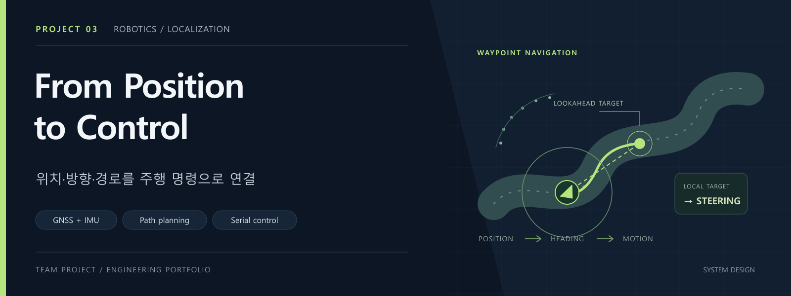
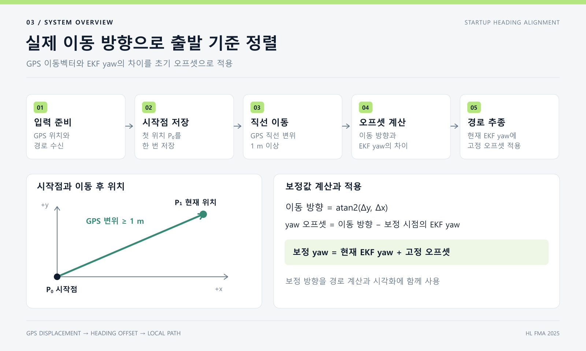
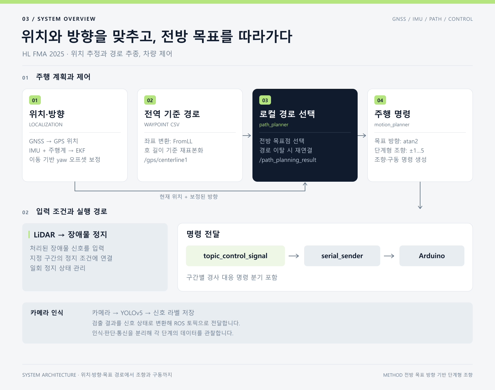

# HL FMA 2025 · GPS 경로 기반 자율주행

> 유아용 전동차를 개조하고, GPS 위치·차량 방향·경로를 실제 조향과 구동 명령으로 연결한 ROS 2 프로젝트입니다.

**대회:** HL FMA 2025 자율주행 경진대회 · **팀:** KHUsla · **성과:** 장려상 · **수상일:** 2025.11.04

[개발 과정과 문제 해결](docs/development-notes.md) · [팀 원본 저장소](https://github.com/Khusla/HLFMA_2025) · [핵심 코드 안내](docs/code-map.md)

## 프로젝트 한눈에 보기

HENES-T870 유아용 전동차에 카메라·LiDAR·GNSS·IMU와 하위 제어기를 연결하고, 차량에 탑재한 Ubuntu 노트북에서 센서 처리와 주행 판단을 수행했습니다. 상위 프로그램이 목표점 방향과 구간별 조건을 판단하면, 시리얼 명령을 통해 차량의 조향과 구동을 제어하는 구성입니다.

개발의 핵심 과제는 **GPS 경로와 차량이 바라보는 방향의 기준을 맞추는 일**이었습니다. 위치가 맞아도 초기 방향이 어긋나면 전방 경로를 잘못 해석할 수 있었습니다. 출발 후 약 1 m 전진한 위치 차이로 방향 기준을 만들고, 이를 이후 경로 계산에 적용해 초기 방향 문제를 해결했습니다.

| 구분 | 주요 내용 |
|---|---|
| 차량 | HENES-T870 개조, Ubuntu 노트북 탑재, Arduino 기반 하위 제어 |
| 개발 환경 | ROS 2 Humble, Python, 사용자 정의 ROS 메시지 |
| 위치·방향 | GNSS 위치 변환과 IMU·오도메트리 기반 방향 처리, 이동벡터로 초기 yaw 보정 |
| 경로·제어 | 위도·경도 경로 변환, 전방 목표점 선택, 단계 조향, 구간별 구동 조건 |
| 인식 | 카메라 신호등 상태 분류, LiDAR 거리 구간·연속 검출 |
| 개발·점검 자료 | 실차 코드, Arduino 제어 기록, Gazebo 구성, 경로·방향 시각화, 저장 경로 분석 |

공개 코드와 실차 개발 기록을 바탕으로 차량 제작부터 경로 추종, 미션 처리까지 정리했습니다.

## 핵심 해결 사례 · 출발 방향을 실제 이동으로 맞추기

**문제.** 센서와 지도 경로의 좌표를 연결하는 과정에서 초기 방향을 잡는 데 어려움이 있었습니다. 경로를 차량 기준으로 회전시키는 yaw가 어긋나면, 차량 앞에 있는 경로도 옆에 있는 것처럼 계산될 수 있습니다.

**판단.** 시작 위치와 전진 후 위치의 차이를 방향 기준으로 삼았습니다. 초기화 절차에 짧은 직진 동작을 포함하고, 지도에서 관측한 이동 방향과 EKF 방향의 차이를 한 번 계산하는 방식입니다.

**구현.** 경로와 GPS 위치가 준비되면 시작점을 저장합니다. 시작점과 현재 위치의 직선거리가 1 m 미만인 동안 차량 정면의 상대 경로를 내보내고, 기준을 넘으면 이동벡터로 yaw 오프셋을 확정합니다. 이후에는 EKF 방향에 같은 오프셋을 더해 경로를 변환합니다.

*GPS 이동벡터로 출발 방향을 정렬하는 초기화 절차.*

**결과.** 실제 이동 방향을 기준으로 초기 yaw 오차를 보정하고, 이후 경로 계산에 일관된 방향 기준을 적용했습니다. 보정 방향은 별도 토픽으로 발행해 경로 미리보기와 방향 화살표에도 사용했습니다.

[방향 보정 코드](https://github.com/Khusla/HLFMA_2025/blob/48406564072bd34c5d223b7e9fb8b05a2381fa11/src/decision_making_pkg/decision_making_pkg/path_planner_node.py#L219) · [계산식과 구동 연계 상세](docs/development-notes.md)

## 시스템 구성

GNSS 위치와 EKF 방향을 경로계획 단계에서 함께 사용하고, 선택한 상대 경로를 차량 명령으로 연결합니다. 아래 그림은 [공개 코드](https://github.com/Khusla/HLFMA_2025/tree/48406564072bd34c5d223b7e9fb8b05a2381fa11)의 센서 입력부터 구동 명령까지의 흐름입니다.

실차 개발에서는 카메라 신호등 상태를 위치 조건과 연결하고, 다중 경로 선택과 전진·후진 전환으로 미션 처리를 확장했습니다. 공개 코드와 실차 보관본의 구성은 [구현 구성과 설정](docs/technical-notes.md)에 정리했습니다.

## 설계에서 살펴볼 부분

### 같은 변환 기준으로 위치와 경로 연결

GNSS 위치를 변환하는 `navsat_transform_node`의 `FromLL` 서비스로 CSV 경로도 변환했습니다. 경로점은 누적 길이를 기준으로 다시 샘플링하고, 현재 위치와 보정 방향으로 차량 기준 좌표를 계산합니다. 이 경로 표현은 **오른쪽이 +x, 전방이 +y**이므로, 목표 방향 계산도 `atan2(x, y)`를 사용합니다.

[좌표 변환·경로 생성](https://github.com/Khusla/HLFMA_2025/blob/48406564072bd34c5d223b7e9fb8b05a2381fa11/src/gps_path/gps_path/test_path_node1.py) · [좌표와 조향 부호를 연결한 과정](docs/development-notes.md)

### 경로 진행 상태와 구간별 주행 조건 관리

전방 경로를 선택할 때 경유점 통과 여부와 횡방향 이탈을 확인하고, 필요한 경우 앞쪽 경로에서 기준점을 다시 찾습니다. 제어 명령은 `s{조향} f{전륜} r{후륜}` 형식으로 전달하며, 지정한 위치 구간에서는 경사로 구동 조건과 LiDAR 정지 조건을 적용합니다.

실차 보관본에서는 경로 끝에서 정지한 뒤 다음 경로를 선택하고, 전진·후진 상태를 바꾸도록 확장했습니다. [개발 과정 문서](docs/development-notes.md)에서 미션별 상태 전환과 하위 제어 연계를 설명합니다.

### 계산에 사용한 방향을 시각화에도 반영

경로계획기가 사용한 보정 yaw를 `/path_planner/yaw_corrected`로 발행하고, 시각화 노드가 현재 위치·방향 화살표·전방 경로를 구성하도록 연결했습니다. **제어에 사용한 방향과 목표 경로를 함께 확인할 수 있는 관측 경로**를 만들었습니다.

[시각화 코드](https://github.com/Khusla/HLFMA_2025/blob/48406564072bd34c5d223b7e9fb8b05a2381fa11/src/debug_pkg/debug_pkg/gps_path_visualizer_node.py) · [디버깅과 미션 개발](docs/development-notes.md)

## 더 자세히 보기

| 문서 | 내용 |
|---|---|
| [개발 과정과 문제 해결](docs/development-notes.md) | 초기 방향 보정, 좌표 규약, 디버깅, 미션·하위 제어·시뮬레이션 기록 |
| [핵심 코드 안내](docs/code-map.md) | 구현 설명과 연결되는 공개 소스 |
| [구현 구성과 설정](docs/technical-notes.md) | 공개 코드와 실차 보관본의 구성, 좌표·메시지·주요 설정 |

이 저장소는 설계와 개발 과정을 설명하는 포트폴리오입니다. 공개된 팀 소스는 [KHUsla 원본 저장소](https://github.com/Khusla/HLFMA_2025)에 있습니다.

---

[FPGA 드론 프로젝트](https://github.com/jounget5411-lab/fpga-drone-portfolio) · [국민대 자율주행 프로젝트](https://github.com/jounget5411-lab/kookmin-autonomous-driving-portfolio)

